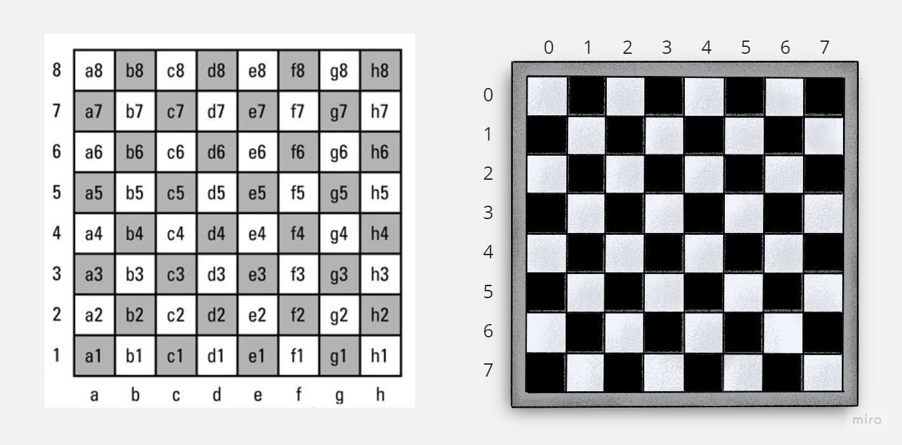
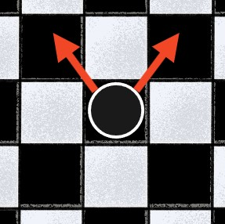
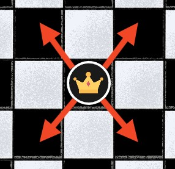
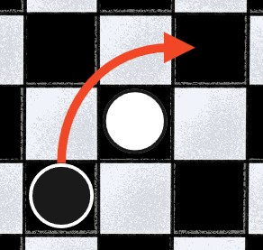

# Checkers
## Overview
This personal project involves revisiting an assignment I completed during my time at Arizona State University. In this undertaking, I have applied design patterns, comprehensive testing, and a culmination of various skills and knowledge to refining the project.

The project's design is intended to be flexible, allowing for future iterations, such as the potential addition of a Chess mode.

## Rules to Checkers
A classic two-player board game with specific rules for moving and capturing pieces. Here are the basic rules for checkers::
1. Game Setup
    - Checkers is played on an 8x8 game board, as shown below.
    - The game is played with 2 players.
    - Each player is given 12 pieces.
    - Pieces are placed on dark squares closest to the player.
      - For player x, pieces occupy rows 1-3
      - For player o, pieces occupy rows 6-8

  

Figure 1: Board with one in Algebraic Notation coordinates and antoher in 2D Matrices coordinates.

2. Piece Movement
    - Pieces shall be able to move diagonally forward only.
    - Pieces shall be able to move one square diagonally forward to an adjacent <b>empty</b> dark square.
    - When a piece reaches the opponent's back row (row 8 for x, row 1 for o), the piece shall be promoted to a King piece.
    - Kinged pieces shall be able move one square diagonally forward and backward.

  

Figure 2: Piece movement

  

Figure 3: Kinged piece movement

3. Capturing
    - A piece shall capture an opponent's piece by jumping over it diagonally forward if the space is unoccupied.
    - A piece shall perform multiple captures in a single turn as long as the jumps are consecutive.
    - A piece that performs a capture shall be placed in the square immediately beyond the captured piece.
    - A player shall be given a choice to choose between capturing a piece or simply moving a piece.

  

Figure 4: Capturing Example

3. Ending the Game
    - The game is won when one player captures all of the opponent's pieces or when an opponent cannot make any legal moves.
    - If neither player can make a legal move, the game ends in a draw or a stalemate.

# Design
## Observer Pattern

## Builder Pattern

## Strategy Pattern